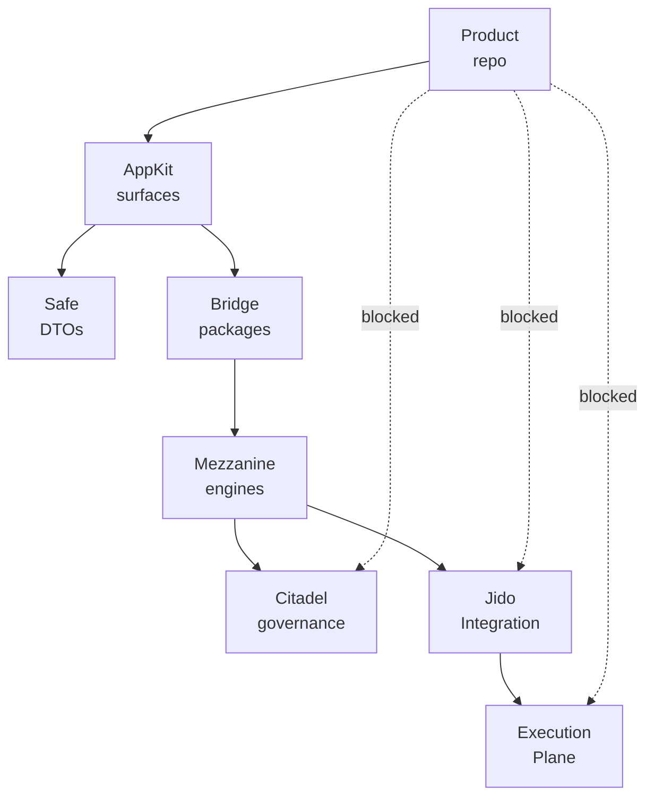
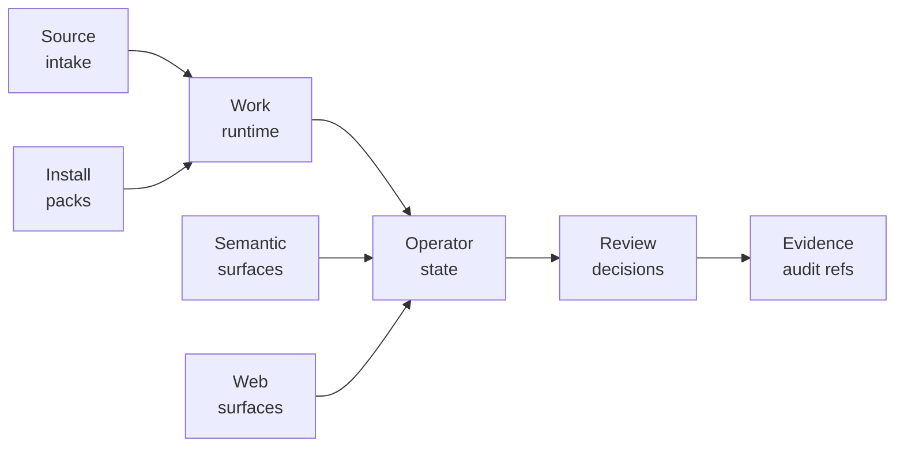

<p align="center">
  
</p>

<p align="center">
  <a href="https://github.com/nshkrdotcom/app_kit">
    
  </a>
  <a href="https://github.com/nshkrdotcom/app_kit/blob/main/LICENSE">
    
  </a>
</p>

# AppKit

AppKit is the northbound application-surface workspace for the nshkr platform
core.

It exists so product applications can consume stable chat, domain, operator,
work-control, runtime-gateway, model inventory, optimization, coordination,
and conversation surfaces without stitching the lower stack manually.

AppKit is also the product boundary enforcement point. Product repos must use
AppKit surfaces for governed writes, operator reads, reviews, installation
bootstrap, semantic assist, trace lookup, leased lower read access, and
multi-agent coordination projection. Direct
product calls into Mezzanine, Citadel, Jido Integration, or Execution Plane are
boundary violations unless the product is authoring a pure `Mezzanine.Pack`
model contract.

Installation bootstrap includes a separate operator-only authoring bundle
import path. Normal installation templates continue to reject deployment and
platform-migration fields; `AppKit.InstallationSurface.import_authoring_bundle/3`
uses `AppKit.Core.AuthoringBundleImport` and the Mezzanine bridge to validate
checksum/schema posture, descriptor policy, and installation revision before
the lower config registry activates anything. Authoring bundles are verified by
checksum/schema validation in v1 unless Phase 1 source-verifies
signing/signature-verification modules and tests or Phase 7 implements signing.
Signature verification is a post-v1/new-contract candidate until then.
`AppKit.Core.AuthoringBundleImport.checksum_for/1` is the product-facing helper
for the canonical `sha256:` checksum used by that v1 posture.

## Scope

- chat-facing surfaces
- typed domain-facing surfaces
- operator-facing surfaces
- reusable work-control and governed-run surfaces
- runtime gateways and conversation bridges
- skill admission, invocation, projection, and trace-ref DTOs
- host-scope and managed-target helpers
- governed model inventory and optimization candidate review surfaces
- governed TRINITY coordination projection and run-control surfaces
- governed adaptive-control approval, promotion, rollback, and audit surfaces
- default cross-stack composition

## Status

Active workspace buildout. The repo uses a non-umbrella workspace layout with
core surface packages, bridge packages, and a proving example host.

## Current Stack Role

AppKit is the northbound contract layer for the active `gn-ten` stack. Product
code should see AppKit as the platform API, not as a convenience wrapper over
lower repos. A product can start work, read operator state, apply review
decisions, publish source updates, request leases, inspect runtime readback, or
render an operator console without knowing whether the backing implementation is
Mezzanine, Citadel, Jido Integration, OuterBrain, Execution Plane, or a
fixture-backed proof host.

The most important boundary is behavioral, not just dependency direction:

- product code expresses product intent and receives product-safe DTOs
- AppKit normalizes that intent into public surface contracts
- bridge packages translate AppKit DTOs into lower owner packages
- lower packages remain free to change internals as long as AppKit contracts
  stay stable

This is why AppKit owns the product no-bypass scanner. The scanner protects the
architecture from accidental direct imports of lower modules that would make a
product depend on implementation details or bypass governance, leases,
redaction, and tenant-scoped checks.

## Current Delivered Surfaces

The workspace currently exposes these product-facing families:

- **Work and runtime:** `AppKit.WorkControl`, `AppKit.WorkSurface`,
  `AppKit.HeadlessSurface`, `AppKit.RuntimeSurface`, and
  `AppKit.RunGovernance` provide governed run start/control, runtime
  projections, headless state/readback, live-effect receipts, and product-safe
  runtime profile application.
- **Operator and review:** `AppKit.OperatorSurface` and
  `AppKit.ReviewSurface` provide queue/detail/review readbacks, review
  decisions, lower-read leases, stream-attach leases, and operator-visible
  projection state.
- **Source and installation:** `AppKit.SourceSurface` and
  `AppKit.InstallationSurface` provide Linear-style source intake,
  current-state lookup, source publication, dynamic tool execution, installation
  bootstrap, and authoring-bundle import.
- **Semantic and app surfaces:** chat, conversation, domain, model, prompt,
  guardrail, memory, budget, cost, eval, replay, coordination, optimization,
  adaptive control, skill, hive, and scope/target helpers provide stable DTO
  seams for richer product experiences.
- **Web surfaces:** shared components, operator console, replay viewer, cost
  dashboard, eval studio, and policy authoring packages give product shells a
  reusable UI vocabulary without making AppKit a product.

Recent Extravaganza-driven work added concrete runtime readback through AppKit:
Codex initial input, first prompt, continuation metadata, app-server protocol,
session start/stop, event stream, token totals, stalled runtime state, Linear
candidate/current-state/publication/GraphQL DTOs, source blocker denial, dry-run
publication forwarding, GitHub PR evidence receipts, and runtime status/logs.

## How To Use AppKit Correctly

Product code should depend on AppKit surface modules and DTOs. It should not
instantiate lower Mezzanine resources, call Citadel policy internals, invoke
Jido connectors directly, inspect Execution Plane lane packages, or read lower
stores. When a product needs a capability that AppKit does not expose yet, add
the lower contract in the owning repo, then expose the smallest product-safe
AppKit surface needed by the product.

Tests and fixture hosts may pass explicit backends through AppKit backend
options. Governed runtime code must not use ambient app env as authority for
backend selection, provider identity, tenant identity, source binding, or
runtime target choice.

## Boundary Diagrams





## Development

The project targets Elixir `~> 1.19` and Erlang/OTP `28`. The pinned toolchain
lives in `.tool-versions`.

```bash
mix deps.get
mix ci
```

Runtime proof output must stay out of tracked paths. Bridge packages that need
mutable archival or trace artifacts write to OS temp roots or ignored generated
directories, and `mix ci` should leave the worktree clean.

The AppKit-owned product-boundary scanner is part of the root CI gate:

```bash
mix app_kit.no_bypass --profile hazmat \
  --include "core/**/*.ex" \
  --include "bridges/**/*.ex" \
  --include "examples/**/*.ex"
```

Product repos run the same task from this workspace with `--root` and both
profiles. `product` blocks direct governed-write imports into Mezzanine,
Citadel, Jido Integration, and Execution Plane while allowing the pure
`Mezzanine.Pack` authoring contract. `hazmat` separately blocks direct
Execution Plane usage so attach and stream behavior stays behind AppKit and
Mezzanine leases.
The default scan excludes `lib/app_kit/boundary/no_bypass.ex` itself so the
scanner's rule table can name forbidden modules without creating a self-hit.
See `docs/product_no_bypass.md` for product-surface scan scope, owner-package
exclusions, and forbidden lower-store imports.

The Phase 4 schema registry is also part of root CI:

```bash
mix app_kit.schema_registry.verify
```

`AppKit.Workspace.SchemaRegistry` is the AppKit-owned contract ledger for
generated BFF/SDK DTOs. `mix app_kit.gen.boundary <schema_name>` accepts only
AppKit-owned schema names from the bounded generator registry, then emits the
DTO, mapper, mapper test, and a deterministic
`generated_artifacts/<schema_name>_schema_registry.exs` manifest with artifact
hashes for release-manifest and Stack Lab proof linkage.

Standalone AppKit surface backends may be configured under the real OTP
application `:app_kit_core`, for example `:installation_backend`,
`:work_query_backend`, `:review_backend`, `:operator_backend`, and
`:work_backend`. Governed calls ignore application-env backend fallback when
they carry `:governed?` or authority-ref options; they must pass explicit
authority-selected backend material or use the compiled AppKit default backend.
Product runtime configuration must not create a synthetic `:app_kit` config
namespace and must not use process config as authority.

Lower-backed operator reads must stay behind AppKit surfaces. The Mezzanine
bridge carries read and stream-attach `authorization_scope` in public DTOs so
product callers cannot bypass tenant-scoped lease checks or call lower-facts
stores with only a raw token.

The Mezzanine bridge also exposes reducer-owned runtime projections through the
typed `AppKit.WorkSurface.get_runtime_projection/3` surface. When an
`operator_subject_runtime` row exists, it returns
`AppKit.Core.SubjectRuntimeProjection` with source bindings, workspace refs,
execution state, lower receipt refs, token totals, rate-limit state, runtime
event counts, evidence refs, pending review decisions, and available operator
commands. `AppKit.WorkSurface.get_projection/3` remains available for named
legacy projections, but product code should prefer the typed runtime DTO for
coding-ops operator views. Runtime values come from Mezzanine projection rows
populated from durable receipts and workflow state; product code must not
supply static provider object ids or environment-variable selectors to make the
projection work.

Operator-visible control-room projections use explicit Phase 4 DTOs:
`AppKit.Core.OperatorSurfaceProjection` carries dispatch state, workflow effect
state, source event position, and `staleness_class`; `AppKit.Core.ObserverDescriptor`
carries redaction policy plus allow/blocked field lists for tenant-safe observer
metadata.

Multi-product certification uses explicit Phase 4 product-fabric DTOs:
`AppKit.Core.ProductTenantContext` proves atomic tenant-context switches,
`AppKit.Core.ProductCertification` records AppKit-only product certification
evidence, `AppKit.Core.ProductBoundaryNoBypassScan` records product no-bypass
scan evidence, and `AppKit.Core.FullProductFabricSmoke` ties certified products,
tenant refs, schema versions, authority refs, workflow refs, and proof bundles
into release-manifest-ready smoke evidence. Product implementations still route
through AppKit surfaces; these DTOs do not authorize direct lower-stack imports.

Phase 15 product no-bypass proof extends that boundary to adaptive controls:
products may use `AppKit.AdaptiveControlSurface` and the operator console
`adaptive_controls` section, but product code must not import GEPA, TRINITY,
provider SDKs, generated SDKs, lower runtimes, DB repos, or trace writers to
review candidates, inspect shadow/canary state, promote, roll back, or audit.

Phase 7 persistence posture is carried as projection evidence only. Authority
projections, headless DTOs, runtime readback/projection DTOs, evidence-audit
DTOs, and projection bridge payloads default to memory/ref-only posture under
`:mickey_mouse`; optional projection retention `:off` disables retention
without blocking provider effects or runtime readback. Product code configures
persistence through AppKit/product surfaces, and the no-bypass scanner rejects
direct product imports of lower store modules.

The welded `app_kit_core` artifact is tracked through the prepared bundle flow:

```bash
mix release.prepare
mix release.track
mix release.archive
```

`mix release.track` updates the orphan-backed `projection/app_kit_core` branch
so downstream repos can pin a real generated-source ref before any formal
release boundary exists.

## Documentation

- `docs/overview.md`
- `docs/layout.md`
- `docs/surfaces.md`
- `docs/composition.md`
- `docs/persistence.md`
- `docs/product_no_bypass.md`
- `CHANGELOG.md`

This project is licensed under the MIT License.
(c) 2026 nshkrdotcom. See `LICENSE`.

## Temporal developer environment

Temporal runtime development is managed from `/home/home/p/g/n/mezzanine`
through the repo-owned `just` workflow. Do not start ad hoc Temporal processes
or rely on the `temporal` CLI as the implementation runbook.

## Native Temporal development substrate

Temporal runtime development is managed from `/home/home/p/g/n/mezzanine` through the repo-owned `just` workflow, not by manually starting ad hoc Temporal processes.

Use:

```bash
cd /home/home/p/g/n/mezzanine
just dev-up
just dev-status
just dev-logs
just temporal-ui
```

Expected local contract: `127.0.0.1:7233`, UI `http://127.0.0.1:8233`, namespace `default`, native service `mezzanine-temporal-dev.service`, persistent state `~/.local/share/temporal/dev-server.db`.

See `docs/temporal_operator_surface.md` for the AppKit boundary around Temporal-backed operator state. AppKit consumes Mezzanine workflow projections/facades, treats Mezzanine's retained Oban outbox/GC queues as local runtime internals, and must not import Temporal directly or inspect Oban rows as workflow truth.

## Persistence Documentation

See `docs/persistence.md` for tiers, defaults, adapters, unsupported selections, config examples, restart claims, durability claims, debug sidecar behavior, redaction guarantees, migration or preflight behavior, and no-bypass scope when applicable.
